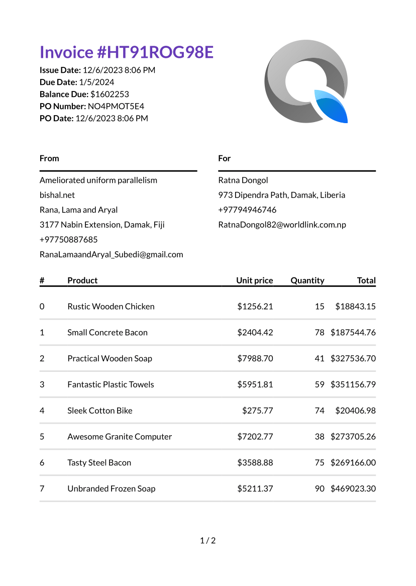
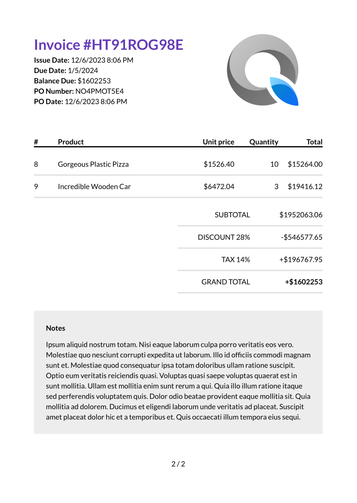

# oig
Invoice generation in the form of PDF using C#.NET and [QuestPDF](https://www.questpdf.com/) library.

Complicating the existing simple-sample project: <https://github.com/QuestPDF/QuestPDF-ExampleInvoice>

This solution comprises multiple projects:
1. `oig.domain`: Contains domain files such as models or entity models or entities.
2. `oig.domain.source.faker`: Contains Faker classes for each entity that help generate corresponding instances filled with fake data.
3. `oig.pdf`: Contains the invoice-document class that takes an invoice instance and fills the data into a template to generate an invoice PDF.
4. `oig.main`: A console app serving as the main entry point to test the aforementioned projects.

## How to run?
1. Configure the single startup project to be `oig.main` in your Visual Studio.
2. Click the play button ▶️. That's it!

## Screenshots

